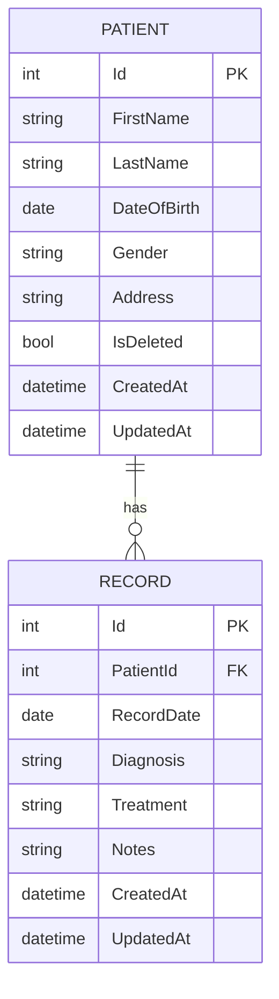

# patient-mgt

# Patient Management API

A sample CRUD API for managing patients and their medical records

## Key Features

- **Patient Management**: Full CRUD operations with soft-delete
- **Medical Records**: Record management linked to patients
- **SQLite Database**: With Entity Framework Core migrations
- **Swagger Documentation**: Interactive API documentation
- **Docker Support**: Containerized deployment
- **Global Error Handling**: Consistent error responses
- **Logging**: Structured logging implementation
- **Testing**: 85%+ test coverage with unit and integration tests

## Technology Stack

- .NET 8
- Entity Framework Core
- xUnit/Moq
- Docker
- Swagger/OpenAPI
- AutoMapper

## Architecture

```
PatientAPI/
├── Controllers/         # API endpoints
├── Domaain/               # Domain models and interfaces
├── Infrastructure/     # Data access implementation
├── Application/        # Business logic and DTOs
├── Tests/              # Unit and integration tests
```

## API Endpoints

### Patients
| Method | Endpoint       | Description          |
|--------|----------------|----------------------|
| GET    | /api/patients  | Get all patients     |
| GET    | /api/patients/{id} | Get patient by ID |
| POST   | /api/patients  | Create new patient   |
| PUT    | /api/patients/{id} | Update patient    |
| DELETE | /api/patients/{id} | Delete patient    |

### Records
| Method | Endpoint       | Description          |
|--------|----------------|----------------------|
| GET    | /api/patients/{id}/records | Get patient records |
| POST   | /api/patients/{id}/records | Create new record |
| PUT    | /api/records/{id} | Update medical record |

## Getting Started

### Prerequisites
- .NET 8 SDK
- Docker (optional)

### Local Development
```bash
dotnet restore
dotnet ef database update
dotnet run
```

### Docker
```bash
docker build -t patient-api .
docker run -p 8080:80 patient-api
```

## Testing
```bash
dotnet test
```

## Error Handling

Standardized error responses:
```json
{
  "type": "https://tools.ietf.org/html/rfc7231#section-6.5.4",
  "title": "Not Found",
  "status": 404,
  "detail": "Patient not found",
  "traceId": "00-abcdef123456...-00"
}
```

## Logging

Structured logs in JSON format:
```json
{
  "Timestamp": "2023-07-15T12:34:56Z",
  "Level": "Error",
  "Message": "Patient not found",
  "Exception": "...",
  "Properties": {
    "Endpoint": "GET /api/patients/123",
    "CorrelationId": "abc123"
  }
}
```

## Database Schema



## Design Decisions

1. **Clean Architecture**: Separation of concerns with clear layer boundaries
2. **Soft Deletes**: Implemented via IsDeleted flag for auditability
3. **Repository Pattern**: Abstracted data access for testability
5. **DTOs**: Prevent over-posting and shape responses
6. **Async/Await**: Full async stack for scalability
```

## Performance Considerations

- Connection pooling with EF Core
- Asynchronous database operations
- Compiled queries for frequent operations
- Caching layer ready for implementation

## Security

- Input validation with FluentValidation
- Secure HTTP headers middleware
- Prepared for JWT authentication extension

## Contributing

1. Fork the repository
2. Create feature branch (`git checkout -b feature/foo`)
3. Commit changes (`git commit -am 'Add foo'`)
4. Push to branch (`git push origin feature/foo`)
5. Create new Pull Request

## License

MIT License - see [LICENSE](LICENSE) for details

---

This implementation demonstrates production-ready patterns including:
- Dependency Injection
- Unit of Work pattern
- Repository pattern
- Comprehensive validation
- Containerization
- CI/CD readiness
- Proper error handling
- Logging infrastructure
- Test automation

Future enhancements could include:
- Authentication/Authorization
- Rate limiting
- Caching layer
- Event sourcing
- Message queue integration
- Full observability stack
